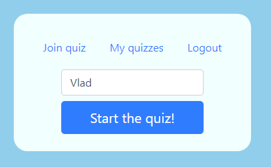

**Vlad Nahimovich OOP coursework report**

**Introduction-**

 The topic chosen is: “Quiz Platform”.
 The platform allows users to register and create custom quizzes, and of course every user can participate in the quiz and get a result (grade from 0-10). The project contains a web interface designed in vanilla JS and bootstrap CSS.

**Framework and requirements:**
 The project designed in Flask framework, coded mainly in python, html, css, regex, and JS.
 In order to run the project you need to install:
 Flask, Flask-Login, SQLalchemy simply write (pip install flask, pip install flask-login, pip install flask-sqlalchemy) 

 And of course web browser will be essential 

**How to use the program:**
 The usage of the program generally isn’t complicated. The website includes pretty accessible interface. 

 Homepage: 

 When you launch the website you see this interface, you can connect to the existing quiz or create your own quiz. There are some checking functionality implemented, for example if the user enters wrong pin etc.

 Registration:

 

 Simple registration form. You will be required to enter email, nickname and password. There is an algorithm in behind which checks your input, it will not accept passwords such as 123456 or passwords shorter than 6 letters. As you can see in the picture, the errors will be displayed. This is implemented with creation of Message class and checking class which inherits the Message class and outputs the error it found.

 Login:

 

 After the registration we have to login, checking and error handling also implemented.

 Quiz creation:

 

 After the user logs in we will be able to access his quiz manager, and create quiz. Messages with events displayed using the class Message in python. Quiz ID will be displayed, and you will able to access it by entering this id.

 Question addition/edit: 

 

 After you created the quiz, you can edit the questions. Similarly to previous parts.

 Answer addition/edit: 

 Similar interface to the question addition, but you can decide if the answer is correct or not. The program supports multiple choice, so you can add as many as possible correct and wrong answers.

 Quiz itself- 

 

 After entering the quiz PIN you will be required to enter a nickname, doesn’t matter if you’re logged in or not, because the nickname requirement in different organizations may differ.

 After entrance of nickname, you will be redirected to the quiz itself

 

 After the completion of the quiz, you will be redirected to the result page. 

 The results may be managed from the control panel of the administrator of the quiz 

 **Body/Analysis:**

 As almost every fullstack application we involve lots of stuff everywhere, so many things built simultaneously and with coordination and connections between them.

 Flask took place as a framework for the application. Flask is one of the most popular frameworks in python, with rich documentation and solutions from the community, so I decided to pick it (learned it and python from scratch in this course).

 **Database:**
 My decision was to create relational database for clearer syntax and overall simplicity. While sacrificing some insignificant amount of performance.

 ‘User’ table has columns such as nickname, password etc. It has also ‘quizzes’ column, which relates to the table ‘Quiz’ that also relates to other two tables – Question and Results.
 Basically after each user completes its Quiz the result applied to the results of the Quiz table, and in the interface the administrator can see it and delete if he wishes to. Then questions stored into the quiz and answers to each question stored in the Question table. So, the table  implements polymorphism, each table is a class that has many different objects of other classes inside.

 Code structure and implementation:

 **Initialization class:** 

 We use several OOP principles in the class initialization, method ‘create\_app ()’ takes place in the initialization. The method should be called, in order to create the application. The method completely hides the variables and implementation, so this is use of abstraction.

 The method ‘create\_app’ triggers ‘create\_database’ (if the db isn’t exist) demonstrating dependency.

 In the create app I registered three blueprints, quiz, auth, view, each of them responsible for different pages or functionality. The blueprint is a superclass that shaping factory method pattern, it assigns the routes and views to our methods.

 **User management system:**

 I used the flask-login plugin, which basically responsible for managing user sessions in more secure way I can create, also it demonstrates the ability to keep the user session while I’m cleaning different sessions, so saves many lines of code, and provides better security and functionality. The  login class is subclass of the blueprint superclass.

 Registration – We get ‘POST’ method to communicate with the UI. In general flask is setup in the way I can pass variables from backend to frontend easily. During almost all the project I am working with ‘POST’ method and few times with ‘GET’. The register from works in a simple way, it checks  if the user authenticated and if its positive – it redirects the user to the home page. There are also few validations, such as invoking the ‘CheckCredentials’ and ‘CheckDB’ classes.

 Login – The login page invokes ‘POST’ method and in the backend we check if the credentials match our standards (avoiding db request), for example if the password is 123456, its impossible to create account with this kind of password, so its also impossible to login with this password.

 Logout – There is a built in method in flask login, we invoke the pattern using decorator pattern. 

 Important to note that the project is in educational purposes, and I didn’t hash the passwords.

 The website always checks if the user logged in, and the frontend acts accordingly, for example the navbar changes, or some pages aren’t accessible (vice versa).

 **The quiz management platform:**

 The management platform is the most complicated one in the project. The ‘Quiz’ (and the following classes) is subclass of superclass blueprint, using the factory method pattern and decorator for checking if user logged in. The user logged in checks if there is a session with the user details, and in case don’t it just returns the user to the homepage.

 It’s important to note that the code widely interacts with the JS, the ‘POST’ requests are sometimes received though JSON, directly from the form, implemented by framework, I also used ‘GET’ method in some cases such as quiz URL. 

 There are many ways to send ‘POST’ requests, but I chose to use a variety of them and concluded that it is better to use different methods in different scenarios.

 All the quiz management platforms follow a similar pattern with slight changes and adaptation so I will explain in general how it works.

 There are 3 pages that share some similarities, manage, edit\_questions, edit\_answers. In manage – you can add quiz, the frontend sends ‘POST’ request to the backend the backend receives it and processing it, in case that the input is invalid it using ‘DisplayMessages’ class to display the error or using the same object to display success message. The delete and edit buttons are implemented by separate method, that handling post request. The addresses using ‘GET’ method to retrieve the data from the database.

 The ‘answer’ method slightly differs from ‘Manage’ and ‘Question’ methods, there is an answer state in the Answers it may be correct or wrong, when the user is clicking on the button it changes the question state, by sending POST request, implemented by JavaScript and JSON.

 Polymorphism in the quiz management:
 The quiz management itself has many forms, there are different quizzes that may be created and different panels, users and a lot more. Also, the ‘helper’ classes have multiple forms.

 Inheritance in the quiz management:
 The subclasses “CheckDB” and “CheckCredentials” inherited in the class “DisplayMessages”, to represent messages on the page using this class, they identify and display the exact error in the database or text/password/email. 

 Abstraction in the quiz management:
 Abstraction is widely used in the application, for example in helper classes there is class ‘CheckCredentials’ with ‘password’ method which is using other method to check if password is bad, such as repetitive password and popular passwords. In addition, the JavaScript methods are pretty much about abstraction, we invoke some methods using python in JavaScript.

 Encapsulation in the application:
 Private and Public methods used in the helper function to prevent unwanted bugs and increasing security, for example the method that checks if the password it common, short or repetitive is private function, I don’t want others to see the implementation of it.

 Testing:
 The program helpers were tested using unittest library in python, they pass it. Also it strictly tested manually. Only frontend optimization requires some work, for different browsers and mobile. In the near future I will use some more advanced frameworks for it.

 **Results:**

 After some effort, I implemented helpful platform, that may help students study subjects that require repetition, for example language courses. Also I think there are many use cases to it and with some improvements the application can be opened to the internet community.

All the requirements fulfilled, the program is following Factory Method and Decorator design patters, and all the OOP principles used for many times.

 **Challenges:**

 Studying flask in the beginning was a little time consuming.

 **Conclusions:**

 Key findings:
 Flask is decent framework, provides great infrastructure to create complex programs in efficient way and incredible speed.
 Design patters:
 Must be used for better code readability and increasing the development process.

 OOP principles:
 The principles should be understood and implemented everywhere. Also significantly increase the speed and make the bug hunting easier.
 Planning:
 Before writing the first line code we should plan and understand what we want to implement during the project. We must plan how the databases will look, how the frontend will communicate with backend and also which strategy to use to avoid unnecessary time wasting and issues. I drew it on paper and had an exact understanding how the application will look.

 Start with frontend:
 Is extension to planning, personally, better to know how the application will look and which methods and strategies to use to implement the backend.

 Avoid bugs:
 Also part of planning, we have to ask questions such as:
 What we need to check, or what can lead to unexpected behavior and what tools I have to develop the application.

 Write clean and use proper name conventions:
 Writing clean code with good name conventions leading to better understanding of overall mechanism of the application and “feeling of connection” to the software you are creating.

 **Extension of the application:**
 1\. I want to add synchronous communication
 2\. Add some non-mandatory functions in quiz management such as arrows back and forth, detailed review of the results (will be defined by administrator) and many more functions like this.
 3\. Experimental launch to the internet, involving hosting and domain.
 4\. Security – to avoid stuff like HSS attacks, and SQL penetration (The app is vulnerable, and the changes will not published on GitHub).
 5\. Adding text answers, image selection, media player for selecting voice messages, adding speech recognition algorithms for answers and bunch of functions like this (we can also replicate duolingo), using this platform.
 6\. Adding a page with quizzes made by the community (for example language).
 7\. Addition of ML algorithms, supervised and unsupervised for variety of purposes.

 Overall, the app can be used in various scenarios and potentially overcome the competition with better UI and simplicity, the competitors charge money, their interfaces are more complex, we can more try to rely on the community, so users will be available to post their own quizzes on various topics.

 Thank you very much for reading my report, I will improve and start to extend the application, only 5% is done from those ideas I mentioned, but still it’s a good start for me.

